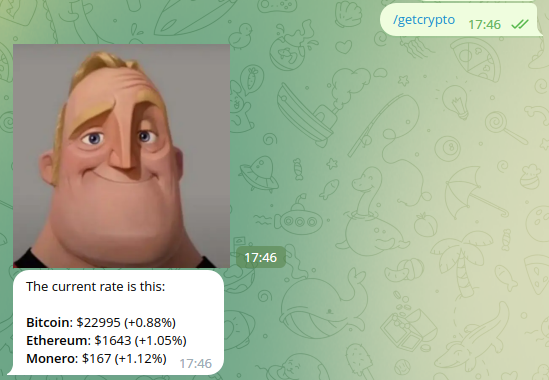
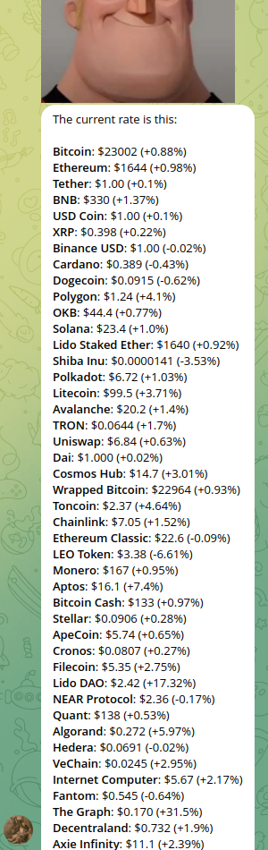
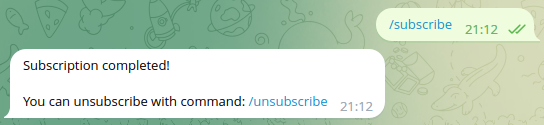
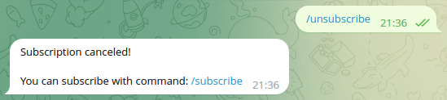
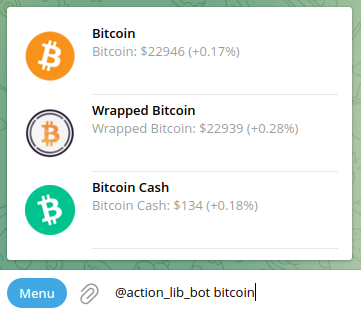
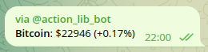

# Pheidippides - crypto rate bot

### Table of contents:
- [Introduction](#introduction)
- [Setup](#setup)

### <a name="introduction"></a> Introduction
This bot provides cryptocurrency rates!
- Enter `/getcrypto` to output a short list of cryptocurrencies
or `/getallcoins` for extended output:

| Short list                                     | Extended                                           |
|------------------------------------------------|----------------------------------------------------|
|  |  |

- You can subscribe to daily cryptocurrency rate with commands: `/subscribe`, `/unsubscribe`.
After subscribing, the bot will send a message similar to `/getcrypto` twice a day:

| subscribe                                      | unsubscribe                                        |
|------------------------------------------------|----------------------------------------------------|
|  |  |

- And don't forget to try `@action_lib_bot` operator:

| Query                                        | Query-message                                        |
|----------------------------------------------|------------------------------------------------------|
|  |  |


### <a name="setup"></a> Setup
- `git clone https://github.com/peskovdev/pheidippides.git`
- `cd pheidippides`
- Create `.env` file and substitute your botfather token:
  ```bash
  cp ./src/.env_example ./src/.env
  ```

- Initialize static files - get the stickers id
  - Run temporary server:
    - in order to change `command`in `docker-compose.yml`, comment 7 line and uncomment 8
    - run: `docker-compose up --build`
  - In chat with bot enter: `/fill_stickers`
  - Then stop server, and check `mood_stickers.json`
  - In `docker-compose.yml` change command back
- Enable inline mode (`/setinline` in chat with `@BotFather`)
- Finally run bot: `docker-compose up --build`


### Donations
- Bitcoin: `bc1qfkvg8q3w9sdf6jqkldqgrv7u0t4pktayd050l3`
